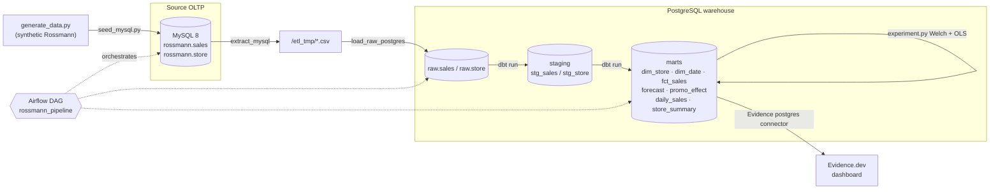

# Rossmann Store Intelligence

> A fully containerized, reproducible retail-analytics pipeline: **MySQL → ETL → PostgreSQL warehouse → dbt star schema → demand forecasting + promo A/B experiment → Evidence dashboard**, orchestrated end-to-end by **Airflow** — all from a single `docker compose up`.

### Tech stack

**Orchestration & infra**


**Data stores**


**Transform & modeling**


**Forecasting, experiment & viz**


A single `docker compose up` ingests store sales from a source OLTP database, models them
into a warehouse star schema, forecasts demand, estimates promotional lift, and publishes
a code-based BI dashboard — orchestrated end to end by Airflow.

Everything is agent-buildable and self-verifiable: no cloud auth, no GUIs, no Kaggle
download. If `./data/*.csv` is absent it is generated synthetically to the Rossmann
schema.

## Architecture



**Airflow DAG** (`airflow/dags/rossmann_pipeline.py`):

```
extract_mysql → load_raw_postgres → dbt_run → dbt_test → forecast → ab_test → publish_marts
```

Each task is a `BashOperator` invoking an isolated virtualenv baked into the Airflow
image — `/opt/dbt-venv` (dbt-postgres) and `/opt/analytics-venv`
(pandas/numpy/scipy/scikit-learn/statsmodels) — so the heavy libraries never clash
with Airflow's own pinned dependencies. Airflow only orchestrates.

### Components

| Layer        | Tech                                   | Where |
|--------------|----------------------------------------|-------|
| Source OLTP  | MySQL 8                                | `docker-compose.yml`, `scripts/mysql_init/` |
| Ingest ETL   | Python (pandas + SQLAlchemy)           | `etl/pipeline.py` |
| Warehouse    | PostgreSQL 16 (`raw`/`staging`/`marts`)| `docker-compose.yml`, `scripts/postgres_init/` |
| Transform    | dbt-postgres (star schema, tests, docs)| `dbt/rossmann/` |
| Orchestration| Airflow 2.10 (LocalExecutor, standalone)| `airflow/` |
| Forecasting  | statsmodels SARIMA + sklearn GBM       | `analytics/forecasting.py` |
| Experiment   | scipy Welch t-test + statsmodels OLS   | `analytics/experiment.py` |
| BI           | Evidence.dev (postgres connector)      | `evidence/` |

## Quick start

Prerequisites: Docker + Docker Compose. (On Windows, Docker Desktop must show
"Engine running".)

```bash
cp .env.example .env          # adjust secrets if you like; a working .env is provided
docker compose up -d --build  # builds images, starts mysql, postgres, airflow, evidence
                              # the one-shot `seed` service loads MySQL automatically
```

Wait for the four services to report healthy:

```bash
docker compose ps
```

Run the whole pipeline end to end (deterministic, no scheduler race):

```bash
docker compose exec airflow airflow dags test rossmann_pipeline 2025-06-01
```

Then open the dashboard at **http://localhost:3001** and Airflow at
**http://localhost:8080**.

> **Port note:** the warehouse Postgres is published on host port **5433** (not 5432)
> to avoid clashing with a natively-installed PostgreSQL. Inside the compose network
> services still reach it at `postgres:5432`.

### Regenerating data

```bash
python scripts/generate_data.py        # writes data/train.csv + data/store.csv
```

120 stores × ~2.5 years of daily rows (2013-01-01 → 2015-07-31, 113,040 rows) with
weekly + yearly seasonality, a +15% promotional uplift, a market-wide common demand
shock, and closed-store zeros (Sundays + state holidays).

### Running tests / pieces on the host

```bash
python -m venv .venv && .venv/Scripts/pip install -r analytics/requirements.txt
.venv/Scripts/python -m pytest analytics/tests/ -v       # forecasting + experiment TDD
```

## Findings

Synthetic data, but the methods and verification are real.

### Demand forecast — learned model beats the naive baseline

Walk-forward backtest of total daily chain sales (84-day held-out window, one-step
ahead). The naive baseline is the seasonal carry-forward (last-week value).

| Model            | MAE      | vs naive |
|------------------|----------|----------|
| seasonal-naive   | 40,059   | —        |
| SARIMA(0,1,1)(0,1,1,7) | 48,769 | −21.7% |
| **GBM (log-space, denoised)** | **33,188** | **+17.2% better** |

The GBM wins by predicting the conditional mean from denoised rolling-mean level
features + calendar + planned-promo signals in log space, rather than carrying last
week's unpredictable common shock. Plots: `artifacts/forecast_backtest.png`,
`artifacts/forecast_future.png`. (SARIMA is reported honestly as the runner-up —
on this strongly-seasonal, exact-zero-Sunday series it does not beat the naive
carry-forward; the GBM does.)

### Promotional lift — causal estimate with a confidence interval

OLS of daily store sales on a promo indicator, controlling for **store** and
**day-of-week** fixed effects (open trading days only, n = 94,649):

- **Promo coefficient: ≈ +1,137 sales/day** per store
- **95% CI: [1,123, 1,151]**
- **Relative lift: ≈ +15.0%** over the non-promo baseline
- Effect size: Cohen's d ≈ 0.40; model R² ≈ 0.86; p ≈ 0
- Welch's t-test (assumption-light cross-check): mean diff ≈ +1,136, t ≈ 61, p ≈ 0

The OLS recovers the injected 15% effect, and reports an effect size and interval —
not just a p-value. Published to `marts.promo_effect`.

## Repository layout

```
.
├── docker-compose.yml          # mysql, postgres, airflow, evidence, seed
├── .env.example / .env         # config; secrets via env only
├── data/                       # generated train.csv + store.csv
├── scripts/
│   ├── generate_data.py        # synthetic Rossmann generator
│   ├── seed_mysql.py           # load source data into MySQL
│   ├── mysql_init/             # MySQL DDL (auto-run on first start)
│   ├── postgres_init/          # warehouse db + raw/staging/marts schemas
│   └── screenshot_evidence.py  # Gate-6 dashboard screenshot
├── etl/pipeline.py             # extract / load / publish
├── dbt/rossmann/               # staging + star schema + tests + docs
├── analytics/
│   ├── forecasting.py          # SARIMA vs GBM, walk-forward, plots, marts.forecast
│   ├── experiment.py           # Welch t-test + OLS, marts.promo_effect
│   └── tests/                  # TDD tests (metrics/assertions written first)
├── airflow/                    # Dockerfile (+ isolated venvs) and the DAG
├── evidence/                   # dashboard-as-code (pages + sources)
└── artifacts/                  # plots, MAE table, dashboard screenshot
```

## Verification gates

| # | Gate | How it's checked |
|---|------|------------------|
| 1 | `docker compose up` → 4 services healthy | `docker compose ps` healthchecks |
| 2 | dbt tests pass on the star schema | `dbt test` → 20 passed (not_null, unique, relationships, accepted_values) |
| 3 | Airflow DAG runs end to end | `airflow dags test rossmann_pipeline …` — every task success |
| 4 | Forecast beats naive seasonal baseline | GBM MAE 33,188 < naive 40,059 (+17.2%) |
| 5 | OLS promo coef with effect size + 95% CI | coef ≈ +1,137/day, 95% CI [1,123, 1,151], +15%, d ≈ 0.40 |
| 6 | Evidence builds + renders | `artifacts/evidence_dashboard.png` |

## Out of scope for v1 (future deployment)

Deliberately **not** attempted, because they require human auth / GUIs / cloud
consoles that would break an unattended one-shot. Documented here as the next
deployment milestone:

- **Snowflake** as the warehouse (swap the dbt profile + Evidence connector).
- **AWS RDS / MWAA** (managed Airflow) or **Azure Data Factory** for orchestration.
- **Tableau / Power BI** as alternative BI front-ends.

The pipeline is built so these are connector/profile swaps, not rewrites.
```
